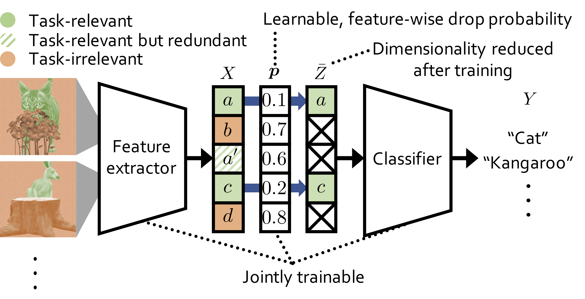

# Drop-Bottleneck (DB)



This is the code for our paper,
* *[Jaekyeom Kim](https://jaekyeom.github.io/), Minjung Kim, Dongyeon Woo and [Gunhee Kim](http://vision.snu.ac.kr/gunhee/)*. Drop-Bottleneck: Learning Discrete Compressed Representation for Noise-Robust Exploration. In *ICLR*, 2021. [[openreview]](https://openreview.net/forum?id=1rxHOBjeDUW) 

In the paper, we propose a novel information bottleneck (IB) method named Drop-Bottleneck, which discretely drops features that are irrelevant to the target variable.
Drop-Bottleneck not only enjoys a simple and tractable compression objective but also additionally provides a deterministic compressed representation of the input variable, which is useful for inference tasks that require consistent representation.
Moreover, it can jointly learn a feature extractor and select features considering each feature dimension’s relevance to the target task, which is unattainable by most neural network-based IB methods.
We propose an exploration method based on Drop-Bottleneck for reinforcement learning tasks.
In a multitude of noisy and reward sparse maze navigation tasks in VizDoom and DMLab, our exploration method achieves state-of-the-art performance.
As a new IB framework, we demonstrate that Drop-Bottleneck outperforms Variational Information Bottleneck (VIB) (Alemi et al., 2017) in multiple aspects including adversarial robustness and dimensionality reduction.
This repository provides the implementation for the exploration method with Drop-Bottleneck and the DMLab navigation tasks.

### Citing the paper
If you find our work or this code useful in your research, please cite

```bibtex
@inproceedings{kim2021_dropbottleneck,
    title={Drop-Bottleneck: Learning Discrete Compressed Representation for Noise-Robust Exploration},
    author={Kim, Jaekyeom and Kim, Minjung and Woo, Dongyeon and Kim, Gunhee},
    booktitle={International Conference on Learning Representations (ICLR)},
    year={2021},
}
```

### Requirements
This codebase was tested on environments with the following components:
* Ubuntu 16.04 machine
* sudo privileges (for installing dependencies)
* CUDA-compatible GPUs
* [Anaconda](https://docs.anaconda.com/anaconda/install/)

### Environment setup
1. Install dependencies for the DMLab pip package following the [instructions](https://github.com/deepmind/lab/tree/master/python/pip_package)
2. (In the main directory) create conda env and activate it by running:
    ```
    conda env create -f environment.yml
    conda activate db-expl
    ```
    Make sure that the environment variable `CONDA_PREFIX` is properly set.
3. Clone [DMLab](https://github.com/deepmind/lab) and build and install DMLab with essential modifications:
    ```
    git clone https://github.com/deepmind/lab
    cd lab
    git checkout 7b851dcbf6171fa184bf8a25bf2c87fe6d3f5380
    git apply ../third_party/dmlab/dmlab_min_goal_distance.patch
    git apply ../third_party/dmlab/dmlab_conda.patch
    bash ./build.sh
    ```
    `build.sh` will try to install some required packages by running sudo commands.


### Training

In order to obtain Table 1 from the paper, the following training commands need to be run:
| Command                                                                                    | Reward condition  | Noise setting  | Average Reward Sum (Test) |
|:------------------------------------------------------------------------------------------ |:-----------------:|:--------------:|:-------------------------:|
| `python scripts/launcher_script_rlb.py --scenario sparse --noise_type image_action`        |       Sparse      |  Image Action  |            30.4           |
| `python scripts/launcher_script_rlb.py --scenario sparse --noise_type noise`               |       Sparse      |      Noise     |            32.7           |
| `python scripts/launcher_script_rlb.py --scenario sparse --noise_type noise_action`        |       Sparse      |  Noise Action  |            30.6           |
| `python scripts/launcher_script_rlb.py --scenario verysparse --noise_type image_action`    |    Very Sparse    |  Image Action  |            28.8           |
| `python scripts/launcher_script_rlb.py --scenario verysparse --noise_type noise`           |    Very Sparse    |      Noise     |            29.1           |
| `python scripts/launcher_script_rlb.py --scenario verysparse --noise_type noise_action`    |    Very Sparse    |  Noise Action  |            26.9           |

Note that the results in Table 1 are the test reward sums averaged over 30 runs for each setting and the actual images used for "Image Action" tasks are not included in this codebase since we do not hold the right to distribute them.

### Evaluation
* Each training command creates an experiment directory under `exp` directory.
* Experiment directories contain `reward_test.csv` files, which list episode reward sums in test environments at each evaluation step.
* From the `reward_test.csv` files, final test reward sums can be obtained by taking the values at step 20M (20044800). Thus, gathering the results can be easily done with shell commands such as
    ```
    grep "20044800," exp/*/reward_test.csv
    ```

### Acknowledgments
This source code is based on the official implementation for [Episodic Curiosity Through Reachability](https://github.com/google-research/episodic-curiosity).
